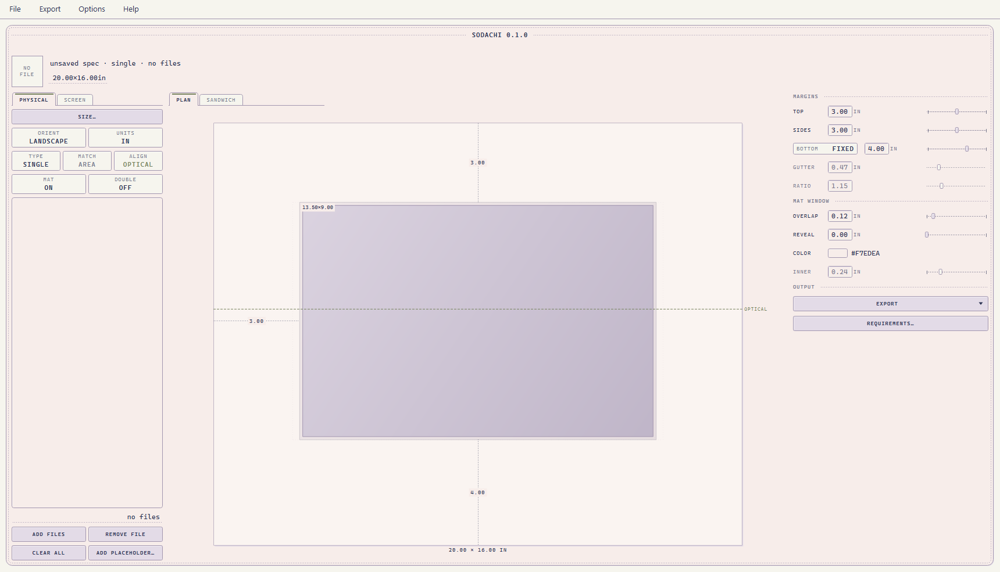

# Sodachi

Layout for images — film scans, digital work, any piece of art headed for a
wall or a feed: borders, diptychs and triptychs, true-scale mat cutting
guides, and cut paths for a computerised mat cutter. One window, nothing to
type but numbers.



**All geometry lives in millimetres; pixels exist only inside the raster
renderer.** One solved layout drives every output, so the preview, the
printed guide, the cutter file and the check table can never disagree.

## Install

Windows: take the packaged build, put the folder anywhere, run
`sodachi-gui.exe`. Nothing to install.

From source: Python 3.11+, then

```bash
pip install "pyvips[binary]"
pip install -e ".[gui]"
sodachi-gui
```

`packaging\build_exe.py` produces the relocatable one-folder build, and
verifies it rather than trusting the exit code.

## What it does

**PHYSICAL** designs the mat. Type the paper size and margins, or work
backwards from **Requirements** (the print you want, the frame you own).
Placeholders let you design around a frame that hasn't been shot yet.
Diptychs and triptychs get equal printed area per frame — `w = sqrt(a/a₀)`,
the rule the icon draws — with optical centring and an optional reveal or
double mat. The sandwich view shows the physical stack exploded.

It exports board work only:

- **Mat guide** — a PDF at exact 100% scale, *mirrored*, because mats are cut
  from the back. Print it with no scaling: the 100mm calibration bar on the
  page is there to check your printer didn't shrink it. Corners carry
  overcut marks sized to the board thickness.
- **Cutter file** — DXF R12, SVG at true scale, or CSV. True geometry,
  deliberately *not* mirrored: a machine orients the board itself, and a
  mirrored path cuts a mirrored mat. Windows first, board outline last;
  a double mat's top windows sit on their own layer.
- **Check table** — every solved number in mm or inches, one COPY away from
  your own print software. Sodachi never renders the print on this side:
  people who print their artwork already have a printing workflow, and what
  it can't invent is the geometry, so Sodachi hands it numbers.

**SCREEN** borders images for posting: one BORDER count (or per-side),
exact pixel output, saved border recipes, and a BATCH chip that writes every
queued file in one pass. Bit depth and ICC profiles are preserved where they
matter and flattened to sRGB where they don't.

Specs are plain YAML — savable, diffable, and they carry the frames the
design was built around, so a mat plan reopens intact with no images on
hand. Fifteen palettes; the window opens to the same neutral screen every
launch.

## Roads not taken

Tried, or designed far enough to see the problem — recorded so future work
doesn't walk in fresh:

- Rendering the print on the physical side (removed — hand print workflows
  numbers, not pixels; the renderer lives on SCREEN where pixels are the
  product)
- Batch and manifest pairing for mats (removed — a mat design is exported
  once and cut forever; list order is the pairing)
- Persistence outside the document (removed — the design lives in its spec
  file; the app opens the same way every time)
- Automatic export destinations (removed — the user picks where files go)
- Duplicate menu surfaces (removed — one door per act)
- Multi-frame Requirements and auto-correcting refusals (declined — the
  forward path answers the first; visible refusal beats silent repair for
  the second)

## Tests

Developed against a suite of 1,100+ tests — geometry proved exhaustively,
outputs read back off disk, cut files parsed and checked against the solver —
run in full before every packaged build. The suite is maintained alongside
the source and is not part of the published tree.

## License

See [LICENSE](LICENSE): run it for anything, personal or commercial; the
source is published for reference; all other rights reserved.
